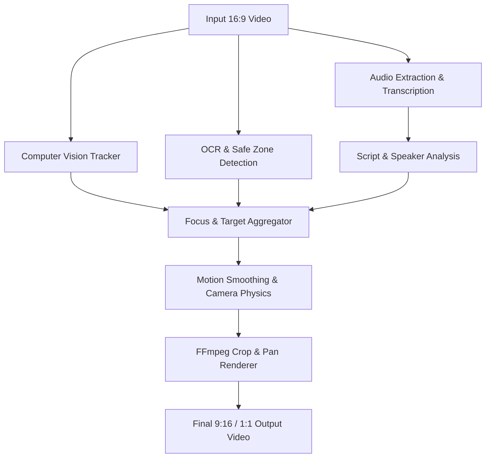

# ?? Aspect Ratio Modifier AI Agent (Auto-Reframe Pipeline)

An intelligent, context-aware video reframing AI system designed to automatically transform horizontal (16:9) video content into vertical (9:16) and square (1:1) formats. It ensures key subjects, active speakers, on-screen text, and critical UI elements stay seamlessly within social-safe zones.

---

## ?? Key Features

- **?? Intelligent Subject & Face Tracking**: Uses MediaPipe Pose & Face Landmarkers to track dynamic actors across frames.
- **??? Active Speaker Detection**: Integrates Faster-Whisper transcription and audio energy timestamps to pinpoint who is speaking and dynamically shift framing focus.
- **?? Safe-Zone & OCR Protection**: Detects on-screen graphics, lower thirds, and titles with EasyOCR to prevent critical content from being cropped.
- **?? Cinematic Motion Smoothing**: Employs adaptive velocity filtering, deadbands, and cubic bezier camera dampening to eliminate jitter and produce smooth pan/crop motions.
- **? Hardware-Accelerated Rendering**: Direct FFmpeg rendering pipelines with zero unnecessary transcodes.
- **?? 250+ Specialized AI Agent Roster**: Built-in Antigravity skills and rules for modular pipeline extensions.

---

## ??? Pipeline Architecture



---

## ?? Quickstart Guide

### 1. Prerequisites
- Python 3.10+ (Python 3.11 / 3.12 recommended)
- FFmpeg installed or available via `imageio-ffmpeg`

### 2. Clone & Install Dependencies
```bash
git clone https://github.com/pudina07/Aspect-Ratio-Modifier-AI-Agent.git
cd Aspect-Ratio-Modifier-AI-Agent

pip install -r requirements.txt
```

### 3. Preload AI Models
Preload all required model weights (MediaPipe, Faster-Whisper, EasyOCR) for zero-latency runtime:
```bash
python download_models.py
```

### 4. Verify Phase 0 Environment
```bash
python verify_phase0.py
```

### 5. Run the Auto-Reframe Pipeline
```bash
python auto_reframe/pipeline_runner.py
```
Or launch the Gradio UI / Interactive App:
```bash
python auto_reframe/app.py
```

### 6. Run Test Suite
```bash
python auto_reframe/run_tests.py
```

---

## ?? Repository Structure

```
+-- .agents/                    # Specialized AI agent skills & rules
+-- assets/                     # Sample media test assets
+-- auto_reframe/               # Production Auto-Reframe pipeline
¦   +-- pipeline/               # Modular stages (transcribe, track, ocr, smooth, render)
¦   +-- tests/                  # Unit and integration test suite
¦   +-- utils/                  # Core I/O and JSON contract utilities
¦   +-- app.py                  # Web application entry point
¦   +-- config.py               # Pipeline hyperparameters and safe zones
¦   +-- contracts.py            # Strict schema validation models
¦   +-- pipeline_runner.py      # End-to-end execution orchestrator
¦   +-- run_tests.py            # Comprehensive test runner
+-- download_models.py          # Automated model weights caching utility
+-- ffmpeg_utils.py             # Cross-platform FFmpeg execution helpers
+-- generate_test_clip.py       # Synthetic test video generator
+-- install_agency_agents.py    # Agency agent installer for Antigravity
+-- requirements.txt            # Python dependencies
+-- safe_zones.json             # Social media platform overlay definitions
+-- verify_phase0.py            # Diagnostic & environment check
```

---

## ?? License
MIT License. Feel free to use and contribute!
